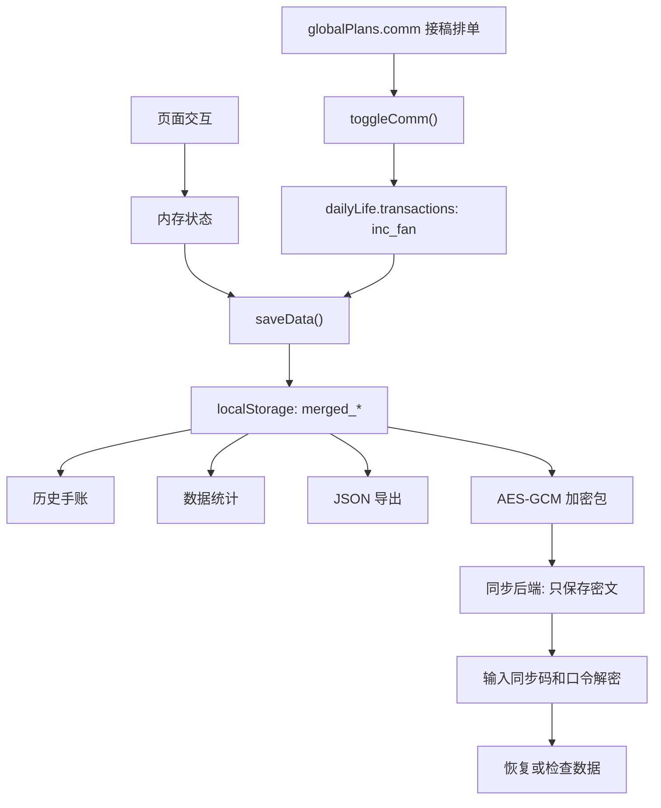

# 平衡器架构说明

## 1. 技术栈选择及原因

### 前端

- HTML：满足本地双击打开、低门槛分享、无构建步骤的目标。
- 原生 JavaScript：项目规模较小，当前不需要引入 React/Vue 等框架。
- Tailwind CSS CDN：快速组织界面样式，适合原型和个人工具。
- 自定义 CSS 变量：维护莫兰迪日夜间配色，主题切换成本低。
- Font Awesome：提供按钮和模块图标。
- Chart.js：实现历史和统计图表，成本低、API 稳定。

### 存储

- localStorage：本地 HTML 场景最容易使用，适合小规模个人数据。
- sessionStorage：保存当前会话内同步口令，避免把口令长期落盘。
- JSON 导出/导入：作为最直接、最可解释的数据备份方式。

### 加密同步

- Web Crypto API：浏览器原生加密，不需要额外依赖。
- PBKDF2-SHA256：从用户同步口令派生 AES 密钥。
- AES-GCM：同时提供加密和完整性校验。
- 后端仅保存密文：减少后端安全责任，适合个人工具和朋友小范围使用。

### 后端

- Cloudflare Worker：适合部署简单、低维护的云端同步接口。
- Windows PowerShell 同步服务：适合自托管和局域网/轻量服务器部署。

## 2. 当前项目目录结构

```text
平衡器/
├─ README.md
├─ PRD.md
├─ ARCHITECTURE.md
├─ .gitignore
└─ frontend/
   ├─ index.html                         # 整理后的前端入口
   └─ assets/
      ├─ css/
      │  └─ styles.css                    # 主题变量、暗色模式、通用动效
      └─ js/
         ├─ app.js                        # 当前业务逻辑
         └─ tailwind.config.js            # Tailwind 主题色和字体配置
```

后端代码暂未同步到 GitHub 展示目录。当前前端中的 `SYNC_API_BASE` 是空字符串，只会使用本机模拟云端密文。等后端方案确定后，再新增 `backend/` 或 `server/` 目录。

## 3. 建议的后续源码目录

当前 `app.js` 已从 HTML 中拆出，但内部仍是一个大脚本。下一步可以按职责继续拆为：

```text
frontend/
├─ index.html
├─ assets/
│  ├─ css/
│  │  └─ styles.css
│  └─ js/
│     ├─ app.js                  # 初始化入口
│     ├─ config/
│     │  ├─ tailwind.config.js
│     │  └─ sync.config.js
│     ├─ core/
│     │  ├─ state.js             # 全局状态和默认值
│     │  ├─ storage.js           # localStorage/sessionStorage 封装
│     │  ├─ date.js              # 日期和时间格式化
│     │  └─ render.js            # 通用渲染辅助
│     ├─ features/
│     │  ├─ theme.js
│     │  ├─ navigation.js
│     │  ├─ timers.js
│     │  ├─ punch.js
│     │  ├─ sleep.js
│     │  ├─ tasks.js
│     │  ├─ life.js
│     │  ├─ plans.js
│     │  ├─ history.js
│     │  ├─ stats.js
│     │  └─ sync.js
│     └─ vendor/
│        └─ README.md            # 说明 CDN 依赖，不存放第三方源码
```

暂时不建议一次拆成 ES Modules，因为本地 `file://` 打开模块脚本时可能遇到 CORS 或 MIME 差异。稳定优先时，可以先保留普通 script，再逐步把函数按区域整理。

## 4. 核心模块说明

### 4.1 页面和导航模块

相关函数：

- `switchPage(page)`

职责：

- 在今日打卡、生活记录、未来规划、历史手账、数据统计之间切换。
- 同步导航按钮的选中状态。
- 进入历史页时渲染历史日期列表。
- 进入统计页时默认渲染最近 7 天。

### 4.2 主题模块

相关函数：

- `initTheme()`
- `toggleTheme()`
- `updateThemeButton()`

职责：

- 读取 `merged_theme`。
- 切换 `body.dark`。
- 更新按钮图标和文案。

### 4.3 计时模块

相关状态：

- `timerStates`
- `activeTimerDateKey`
- `timerLabels`

相关函数：

- `rolloverTimerDay(now)`
- `getElapsed(k)`
- `saveTimerSnapshot(dateKey, states)`
- `saveGlobalTimerState()`
- `toggleTimer(k)`
- `syncAllTimerUIs()`
- `initTimers()`
- `initTimerLabelEditors()`

职责：

- 管理多个计时器的开始、暂停、累计。
- 处理跨日计时，把旧日期快照保存到历史数据。
- 维护四类计时的自定义标签。
- 把计时结果写入当日 `merged_data_<dateKey>`。

计时类型：

```text
literature   阅读
lamoModule   上课
writing      论文
exercise     运动
chores       摸鱼
phone        拉磨
```

注意：`timerLabels` 中当前使用 `experiment` 作为上课标签 key，而计时状态中对应的是 `lamoModule`。后续建议统一命名，避免维护时混淆。

### 4.4 工作打卡模块

相关状态：

- `punchRecords`

相关函数：

- `punchPeriod(period, type)`
- `updateDisplay()`

职责：

- 记录上午、下午、晚间三个工作段的上班和下班时间。
- 在今日页面显示打卡时间。

### 4.5 睡眠模块

相关状态：

- `globalSleep`
- `todaySleepSecs`
- `localSleepDisplay`

相关函数：

- `initSleep()`

职责：

- 记录入睡和醒来时间。
- 计算睡眠时长。
- 正在睡眠的状态使用全局 key 保存，避免跨日或刷新丢失。

### 4.6 待办模块

相关状态：

- `tasks`

相关函数：

- `initTasks()`
- `saveNewTask()`
- `renderTasks()`
- `toggleTask(id)`
- `deleteTask(id)`

职责：

- 新增、完成、删除今日任务。
- 显示任务完成数。
- 数据按天保存。

### 4.7 文本记录模块

相关函数：

- `initNotes()`

职责：

- 把四个文本区域保存到当日 `merged_data_<dateKey>` 中。
- 当前保存按钮为“保存所有文本”。

### 4.8 生活记录模块

相关状态：

- `dailyLife`
- `TRANS_MAP`

相关函数：

- `addLifeItem(type, label = '')`
- `renderLifeZone()`
- `delLife(cat, idx)`

职责：

- 管理餐食、洗漱、交易流水。
- 交易流水按 `inc/exp` 和 `fan/irl` 组合成四类。
- 汇总今日收入和支出。

交易类型：

```text
exp_irl   三次支出
exp_fan   二次支出
inc_irl   三次收入
inc_fan   二次收入
```

### 4.9 规划和排单模块

相关状态：

- `globalPlans`
- `timelineMode`
- `studyPlanMode`
- `fanPlanMode`
- `pendingPlanHides`
- `pendingPlanTimers`

相关函数：

- `addPlanItem(cat)`
- `addCommItem()`
- `renderAllPlans()`
- `setPlanListMode(group, mode)`
- `togglePlan(cat, id)`
- `deletePlan(cat, id)`
- `toggleComm(id)`
- `setTimelineMode(mode)`
- `renderAutoTimeline()`

职责：

- 管理课程、项目、为爱发电、接稿排单。
- 把所有带日期的规划合并为时间线。
- 接稿排单完成时，可把稿费同步写入今日交易流水。

规划类型：

```text
course    课程相关
project   项目计划
con       为爱发电
comm      接稿排单
```

### 4.10 历史模块

相关函数：

- `renderHistoryList()`
- `loadHistoryDetail(dateStr)`

职责：

- 扫描 `localStorage` 中的 `merged_data_` 日期 key。
- 读取同日期的任务、睡眠、生活、摸鱼日志、拉磨日志。
- 渲染当日手账详情和时间分布图。

### 4.11 统计模块

相关函数：

- `renderStats(days)`

职责：

- 按 7/30/90 天聚合历史数据。
- 渲染精力、任务、财务图表。

### 4.12 备份和同步模块

相关常量：

- `SYNC_PBKDF2_ITERATIONS`
- `SYNC_MOCK_CLOUD_PREFIX`
- `SYNC_API_BASE`
- `BACKUP_KEY_PREFIX`

相关函数：

- `generateSyncCode()`
- `encryptSyncPayload(payload, passphrase, syncCode)`
- `decryptSyncPayload(packageData, passphrase)`
- `saveSyncSettings()`
- `uploadEncryptedBackup(passphrase = '')`
- `downloadEncryptedBackup(passphrase = '')`
- `collectLocalBackupData()`
- `exportLocalData()`
- `importLocalDataFromFile(file)`

职责：

- 配置同步码和同步口令。
- 收集所有 `merged_` 前缀数据。
- 生成加密数据包。
- 上传到远端同步 API 或保存到本地模拟云端。
- 从 JSON 文件导入/导出数据。

## 5. 数据模型设计

### 5.1 localStorage key 设计

```text
merged_theme                         # light/dark
merged_timer_labels                  # 计时分类显示名
merged_global_timerState             # 当前计时器运行状态
merged_global_sleepState             # 当前睡眠状态
merged_global_plans                  # 全局规划和排单
merged_sync_settings                 # 同步设置，不含明文口令

merged_timer_<dateKey>               # 某日计时器原始状态
merged_data_<dateKey>                # 某日汇总时长和文本记录
merged_slackLog_<dateKey>            # 某日摸鱼日志
merged_grindLog_<dateKey>            # 某日拉磨日志
merged_punch_<dateKey>               # 某日上工打卡
merged_tasks_<dateKey>               # 某日待办
merged_sleepTot_<dateKey>            # 某日睡眠秒数
merged_sleepDisp_<dateKey>           # 某日睡眠展示字段
merged_life_<dateKey>                # 某日生活记录

merged_mock_cloud_<syncCode>         # 无远端时模拟云端密文
```

`dateKey` 当前来自 `new Date().toDateString()`，例子：

```text
Thu Jun 26 2026
```

后续建议改为稳定的 ISO 日期：

```text
2026-06-26
```

这样更利于排序、跨语言解析和后端同步。

### 5.2 TimerState

```js
{
  literature: { r: false, s: null, t: 0 },
  lamoModule: { r: false, s: null, t: 0 },
  writing: { r: false, s: null, t: 0 },
  exercise: { r: false, s: null, t: 0 },
  chores: { r: false, s: null, t: 0 },
  phone: { r: false, s: null, t: 0 }
}
```

字段说明：

- `r`：是否正在运行。
- `s`：本次开始时间戳。
- `t`：已经累计的秒数。

### 5.3 DailyData

```js
{
  literature: 0,
  lamoModule: 0,
  writing: 0,
  exercise: 0,
  chores: 0,
  phone: 0,
  notes: {
    literature: "",
    experiment: "",
    writing: "",
    exercise: ""
  }
}
```

说明：

- 时长单位为秒。
- `notes.experiment` 当前对应页面上的“上课”文本区。

### 5.4 Task

```js
{
  id: 1710000000000,
  text: "任务内容",
  completed: false
}
```

### 5.5 DailyLife

```js
{
  meals: [
    { time: "12:30", text: "午饭内容" }
  ],
  hygiene: [
    { time: "22:10", text: "洗澡" }
  ],
  transactions: [
    {
      time: "20:00",
      type: "inc_fan",
      text: "稿费结算: 单名",
      amount: 100
    }
  ]
}
```

### 5.6 SimplePlan

```js
{
  id: 1710000000000,
  text: "计划内容",
  notes: "备注",
  date: "2026-06-30",
  completed: false
}
```

适用类型：

- `course`
- `project`
- `con`

### 5.7 CommissionPlan

```js
{
  id: 1710000000000,
  client: "单主",
  title: "单名",
  node: "1",
  price: 100,
  notes: "备注",
  date: "2026-06-30",
  completed: false
}
```

### 5.8 SyncPackage

```js
{
  version: 1,
  algorithm: "AES-GCM",
  kdf: "PBKDF2-SHA256",
  iterations: 150000,
  syncCode: "BREAD-XXXX-XXXX",
  salt: "...base64...",
  iv: "...base64...",
  ciphertext: "...base64...",
  updatedAt: "2026-06-26T00:00:00.000Z"
}
```

### 5.9 数据关系



关键关系：

- 今日页面、生活页面、排单页面都先改内存状态，再调用 `saveData()`。
- 历史和统计不直接改数据，只读取 `localStorage`。
- 接稿排单完成后可以写入今日生活财务流水，因此 `globalPlans.comm` 和 `dailyLife.transactions` 有业务联动。
- 同步后端不理解业务模型，只保存 `collectLocalBackupData()` 加密后的密文。

## 6. 代码规范建议

### 命名

- 数据 key 使用清晰英文：`commission` 比 `comm` 更适合长期维护。
- 同一概念不要混用多个名字，例如“上课”不要同时叫 `experiment` 和 `lamoModule`。
- 日期 key 统一使用 `YYYY-MM-DD`。

### 函数边界

- 一个函数只做一类事：状态变更、存储、渲染、远端请求尽量拆开。
- 渲染函数不要顺手写存储。
- 存储函数不要弹窗。
- 同步函数不要直接依赖页面文案。

### 数据兼容

- 改 localStorage 结构时增加迁移函数。
- 不直接删除旧 key，先读取旧 key 并写入新结构。
- 导入数据前保留当前数据快照或给用户二次确认。

### 错误处理

- JSON.parse 需要兜底。
- 远端同步失败要区分网络失败、404、解密失败。
- 导入失败不能覆盖现有数据。

### UI 约定

- 保持本地文件可用，不引入必须构建的依赖。
- 重要动作需要确认：导入覆盖、清空数据、同步恢复。
- 朋友使用版本优先稳定，不追求复杂动效。

## 7. 当前风险和改进点

1. 远端同步地址写死在 `app.js`。

建议移入设置面板或单独配置文件，避免开源时暴露个人服务器地址。

2. 所有业务逻辑仍在一个 `app.js`。

已经从 HTML 中拆出，但还没有进一步模块化。建议后续按功能区拆分。

3. 日期 key 使用英文 `toDateString()`。

这对排序、迁移和跨时区处理不够稳定，建议改为 `YYYY-MM-DD`。

4. 同步恢复当前只是解密检查。

目前 `downloadEncryptedBackup()` 成功后不会覆盖当前数据，正式恢复功能需要增加预览和确认。

5. 缺少自动测试。

建议至少建立手动测试清单；如果未来引入构建工具，再补 Playwright 冒烟测试。

6. CDN 依赖需要联网。

本地 HTML 虽然能双击打开，但 Tailwind、Font Awesome、Chart.js 依赖 CDN。离线使用需要把依赖本地化。

## 8. 建议的重构顺序

1. 保持 `index.html` 可运行，先不要删除原始单文件。
2. 把 `SYNC_API_BASE` 移到配置文件或页面设置。
3. 统一 `experiment` / `lamoModule` 命名。
4. 增加 `storage.js`，封装所有 `localStorage` key。
5. 增加 `date.js`，统一日期 key。
6. 拆分 `timers.js`、`life.js`、`plans.js`、`sync.js`。
7. 增加手动测试清单和示例数据。
8. 准备 GitHub README、截图、开源协议。
